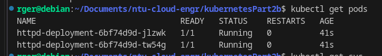
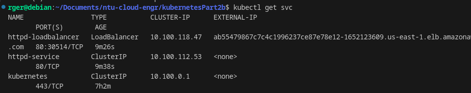
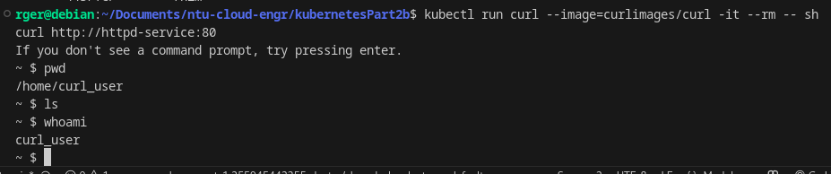

# Apply in recommended order:
kubectl apply -f configmap.yml
kubectl apply -f secret.yml
kubectl apply -f deployment.yml
kubectl apply -f service.yml
kubectl apply -f httpd-loadbalancer-service.yml

